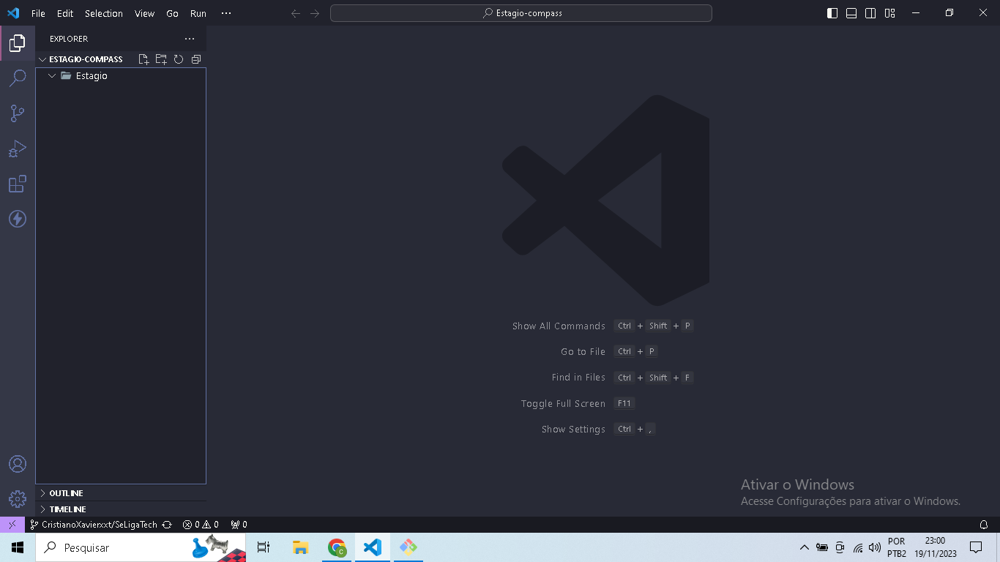
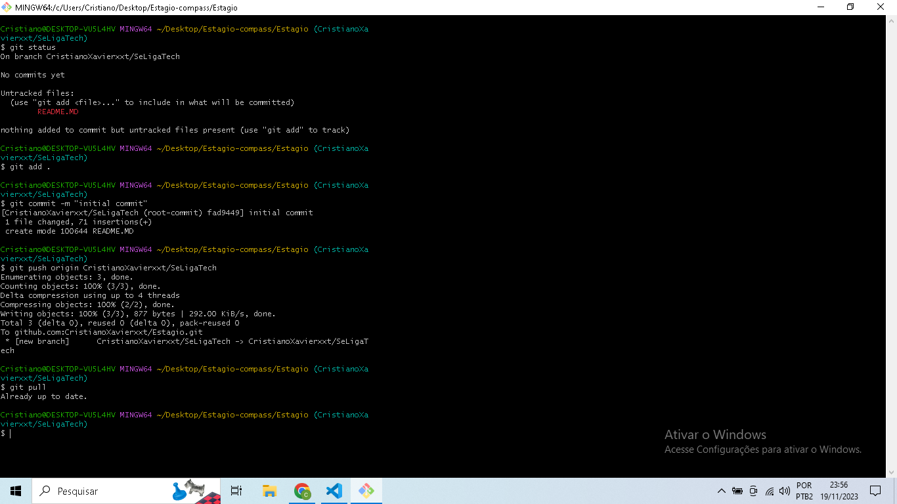
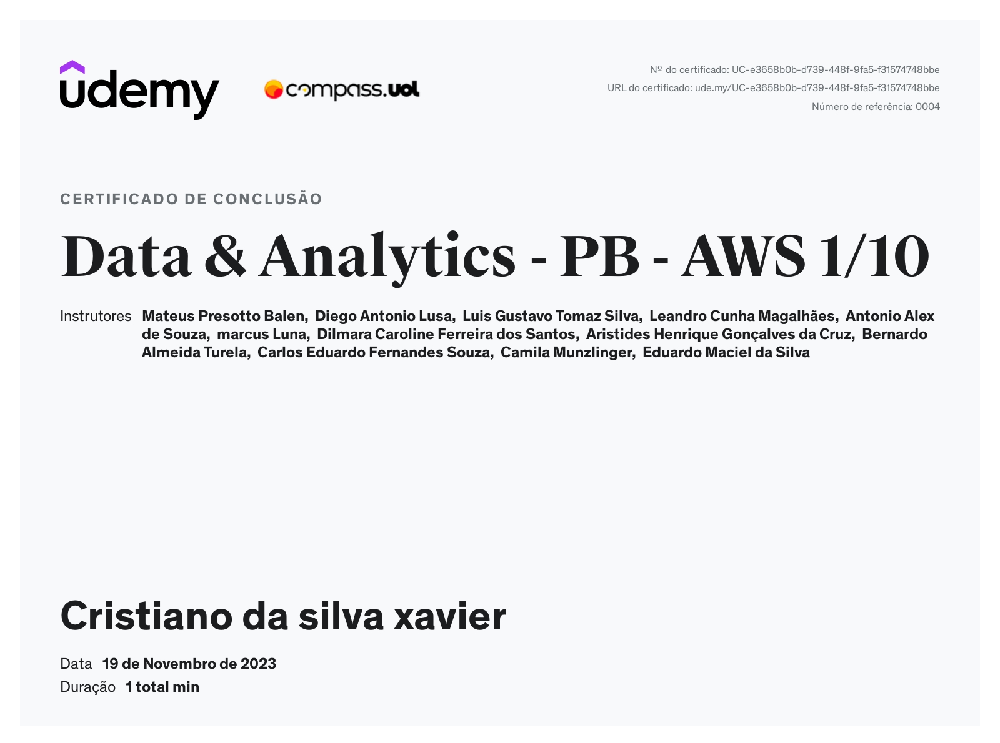

## Sprint 1

Aprendizagem da sprint:

- Nesta sprint fiz um estudo aprofudado sobre os principais comandos tanto para trabalhar com o sistema ubunto linux quanto para usar o git e o github para criar repositorios e versionar meus projetos.
- Finalizamos a sprint com uma atividade com o objetivo de treinar um pouco dos conteudos vistos no curso de git e github e a criação dos READM do projeto e da sprint 1.

## Exercicios

   Exercicio 2
   

   Exercicio 4
   

## Certificado

Certificado de conclusão da atividade Data & Analytics - PB - AWS 1/10

   