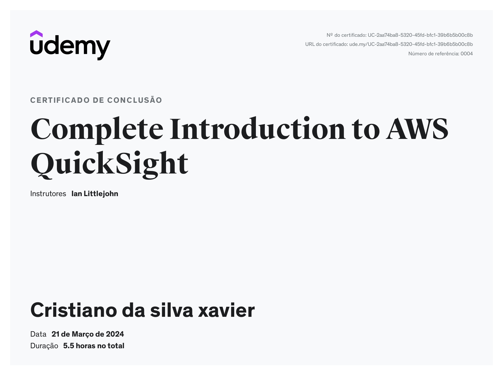
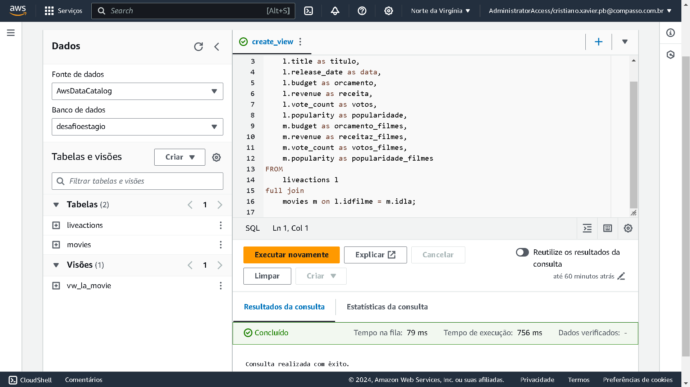
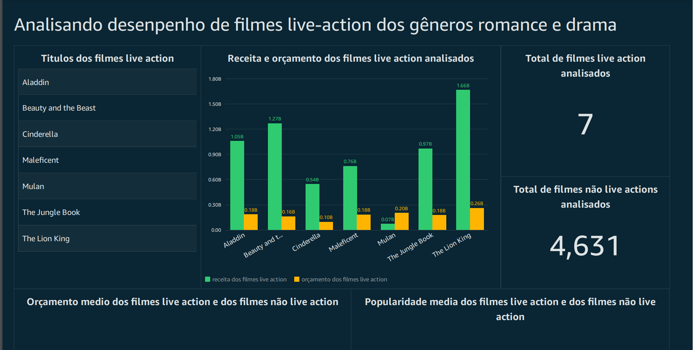
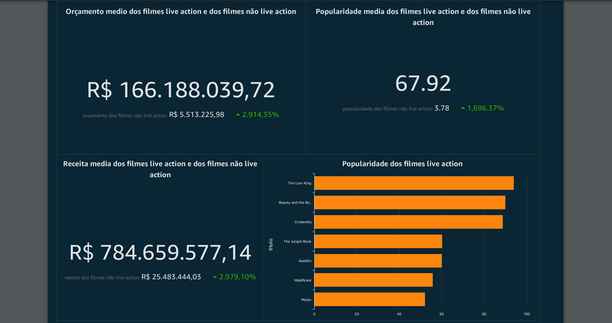
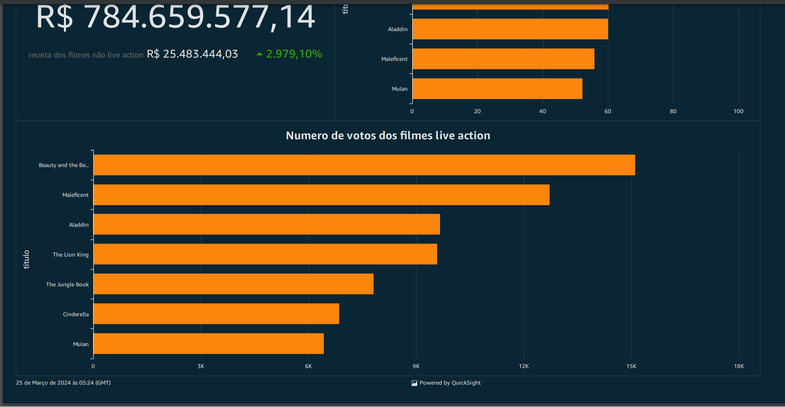

## Sprint 10

Aprendizagem da sprint:
- Chegamos na sprint final do programa de bolsas.
- Nesta sprint estudamos sobre o amazom Quicksight uma ferramente poderosa para a analise de dados permitindo a construção de graficos e a interatividade entre eles.
- Nesta sprint foi finalizado o desafio final do programa de bolsa onde aplicamos os conhecimento com amazom athena e o Quicksight.

## Evidencias

Certificado de conclusão do curso sobre Quicksight.

Evidencia dos exercicios com athena e do desafio final.

