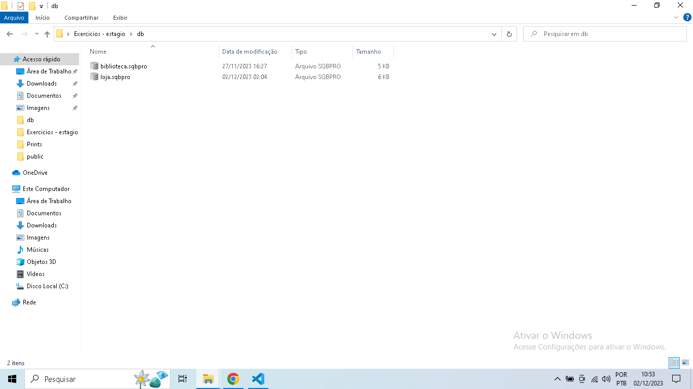

## Sprint 2

Aprendizagem da sprint:

- Nesta sprint fiz um estudo aprofundado sobre SQL e BigData, junto a isso fiz uma grande sequencia de exercicios para testar meus conhecimentos em SQL.
- Finalizamos a sprint com uma atividade com o objetivo de extrair dados de uma consulta em SQL e exportar para um arquivo .CSV.

## Exercicios

- [Exercicio 1 CSV](https://github.com/CristianoXavierxxt/Estagio/blob/CristianoXavierxxt/SeLigaTech/Sprint%202/exercicios/Arquivo1.csv)

- [Exercicio 2 CSV](https://github.com/CristianoXavierxxt/Estagio/blob/CristianoXavierxxt/SeLigaTech/Sprint%202/exercicios/Arquivo2.csv)

- [Codigos-Exercico-Biblioteca](https://github.com/CristianoXavierxxt/Estagio/blob/CristianoXavierxxt/SeLigaTech/Sprint%202/exercicios/ExerciciosBiblioteca.txt)

- [Codigos-Exercico-Loja](https://github.com/CristianoXavierxxt/Estagio/blob/CristianoXavierxxt/SeLigaTech/Sprint%202/exercicios/ExerciciosLoja.txt)

## Certificado

Certificado de conclusão da atividade Big Data Fundamentos 3.0

Certificado de conclusão da atividade SQL para analise de dados 

## Evidencias

Evidencia dos asquivos com as query SQL para a resolução dos exercicios das seções 3 e 4

Evidencia dos codigos do exercicios do caso de estudo Biblioteca - seção 3

Evidencia dos codigos do exercicios do caso de estudo Biblioteca - seção 4

