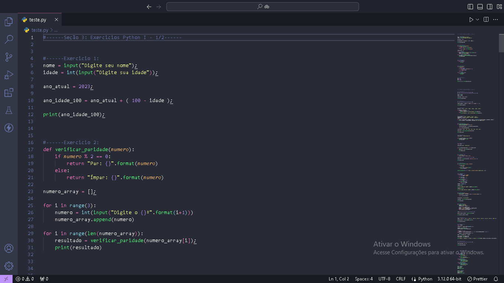
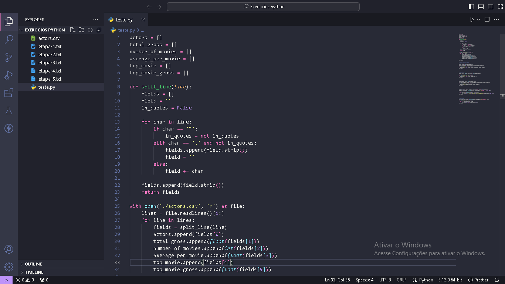

## Sprint 3

Aprendizagem da sprint:

- Nesta sprint fiz um estudo aprofundado sobre python, junto a isso fiz uma grande sequencia de exercicios para testar meus conhecimentos em python.
- Finalizamos a sprint com uma atividade com o objetivo de fazer um ETL em um arquivo .csv.

## Exercicios

- [Resultado Exercicio 1 ETL](https://github.com/CristianoXavierxxt/Estagio/blob/CristianoXavierxxt/SeLigaTech/Sprint%203/exercicios/etapa-1.txt)

- [Resultado Exercicio 2 ETL](https://github.com/CristianoXavierxxt/Estagio/blob/CristianoXavierxxt/SeLigaTech/Sprint%203/exercicios/etapa-2.txt)

- [Resultado Exercicio 3 ETL](https://github.com/CristianoXavierxxt/Estagio/blob/CristianoXavierxxt/SeLigaTech/Sprint%203/exercicios/etapa-3.txt)

- [Resultado Exercicio 4 ETL](https://github.com/CristianoXavierxxt/Estagio/blob/CristianoXavierxxt/SeLigaTech/Sprint%203/exercicios/etapa-4.txt)

- [Resultado Exercicio 5 ETL](https://github.com/CristianoXavierxxt/Estagio/blob/CristianoXavierxxt/SeLigaTech/Sprint%203/exercicios/etapa-5.txt)

- [Codigos-Exercicios-Python](https://github.com/CristianoXavierxxt/Estagio/blob/CristianoXavierxxt/SeLigaTech/Sprint%203/exercicios/Exercicios%20de%20python.txt)

- [Codigos-Exercicios-ETL](https://github.com/CristianoXavierxxt/Estagio/blob/CristianoXavierxxt/SeLigaTech/Sprint%203/exercicios/Exercicios%20ETL.txt)

## Evidencias

Evidencia dos Exercicios de python

Evidencia dos exercicios de ETL

Evidencia de conclusão do curso de python

