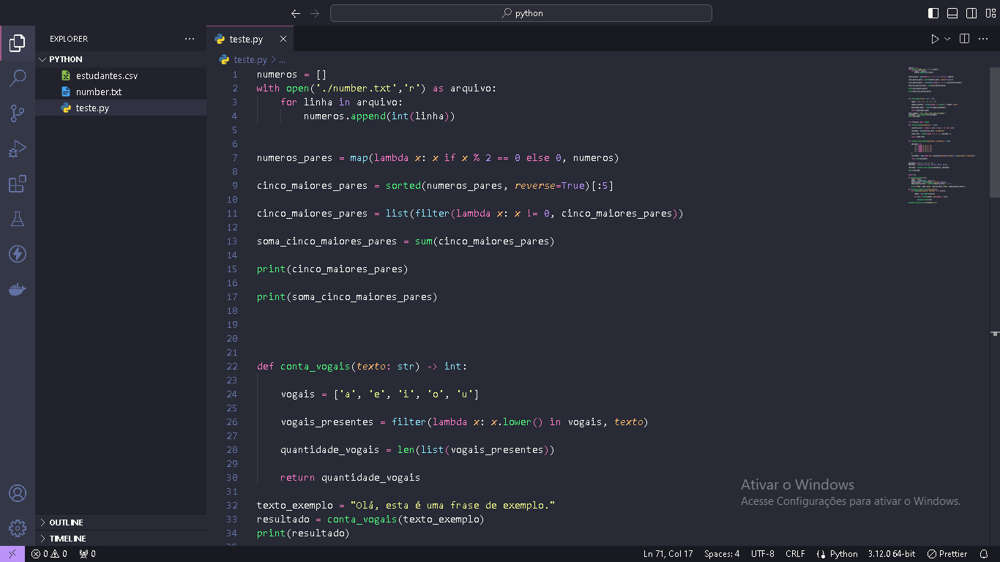
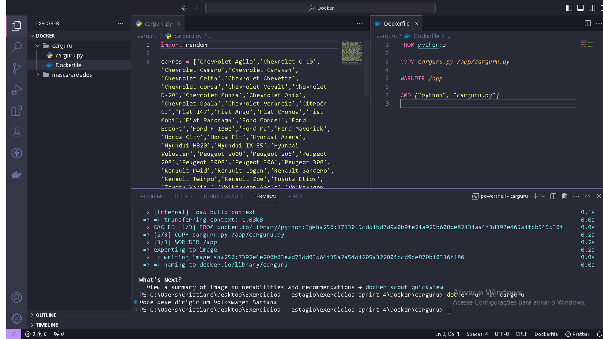
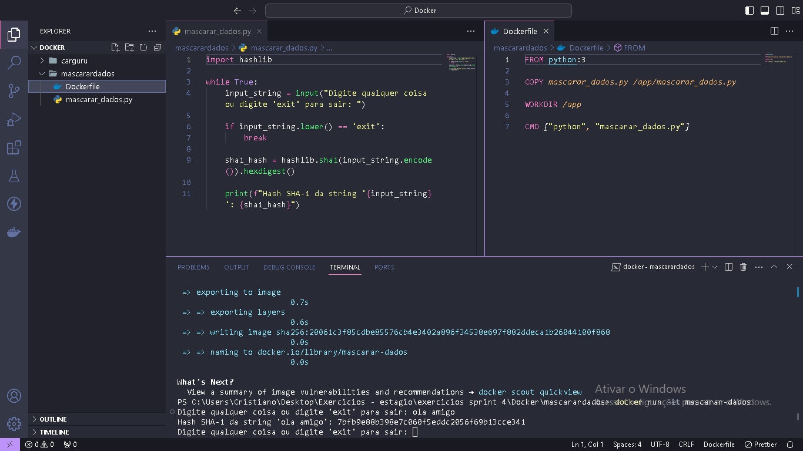

## Sprint 4

Aprendizagem da sprint:

- Nesta sprint avaçamos no conteudo sobre python e vimos também como usar python para trabalhar com estatística descritiva e também aprendemos sobre a ferramenta docker e como usa-la.
- Finalizamos a sprint com uma atividade divida em duas partes, uma com o objetivo de testas nossos novos conhecimentos em python e a outra com o objetivo de testar os conhecimentos sobre docker.

## Exercicios

- [Exercicios python](exercicios/Exercicios%20python%20sprint%204.txt)

- [Exercicios Docker](exercicios/Exercicios%20docker.txt)

## Evidencias

Evidencia dos exercicios de python realizados nessa sprint.

Evidencia do primeiro exercicio de docker

Evidencia do terceiro exercicio de docker

