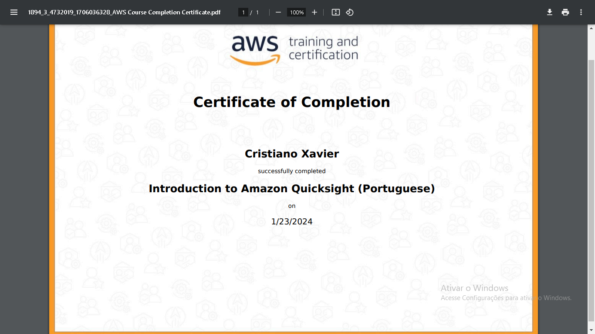

## Sprint 6

Aprendizagem da sprint:

- Sprint totalmente voltada para a aprendizagem sobre os fundamentos de Data e Analytics na AWS, onde finalizamos a sprint com um exercício prático utilizando o console da AWS e todo o conhecimento que adquirimos e sprints anteriores e na respectiva sprint. 

## Evidencias

* Evidencia do exercicio sobre Lab AWS S3.

 

 
 

* Evidencia do exercicio sobre Lab AWS Athena.

 

 
 

* Evidencia do exercicio sobre Lab AWS Lambda.

 

 
 

* Evidencia de Limpeza de Recurso.

 

 
 

## Certificados
    Os certificados estão seguindo a mesma ordem de visualização que está na sprint.

Certificado de conclusão do curso da AWS Skill Builder - Data Analytics Fundamentals (Portuguese)

Certificado de conclusão do curso da AWS Skill Builder - AWS Partner: Data Analytics on AWS (Business)

 

Certificado de conclusão do curso da AWS Skill Builder - Introduction to Amazon Kinesis Streams

 

Certificado de conclusão do curso da AWS Skill Builder - Introduction to Amazon Kinesis Analytics

 

Certificado de conclusão do curso da AWS Skill Builder - Introduction to Amazon Elastic MapReduce (EMR) (Portuguese)

 

Certificado de conclusão do curso da AWS Skill Builder - Introduction to Amazon Athena (Portuguese)

 

Certificado de conclusão do curso da AWS Skill Builder - Introduction to Amazon Quicksight (Portuguese)

 

Certificado de conclusão do curso da AWS Skill Builder - Introduction to AWS IoT Analytics

 

Certificado de conclusão do curso da AWS Skill Builder - Getting Started with Amazon Redshift

 

Certificado de conclusão do curso da AWS Skill Builder - Deep Dive into Concepts and Tools for Analyzing Streaming Data (Portuguese)

 

Certificado de conclusão do curso da AWS Skill Builder - Best Practices for Data Warehousing with Amazon Redshift (Portuguese)

 

Certificado de conclusão do curso da AWS Skill Builder - Serverless Analytics (Portuguese)

 

Certificado de conclusão do curso da AWS Skill Builder - Why Analytics for Games (Portuguese)

