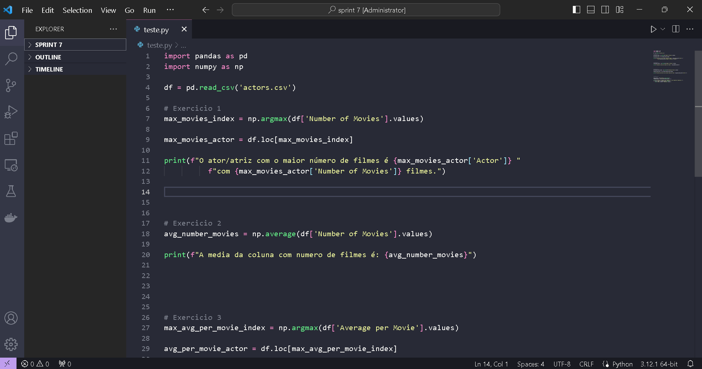
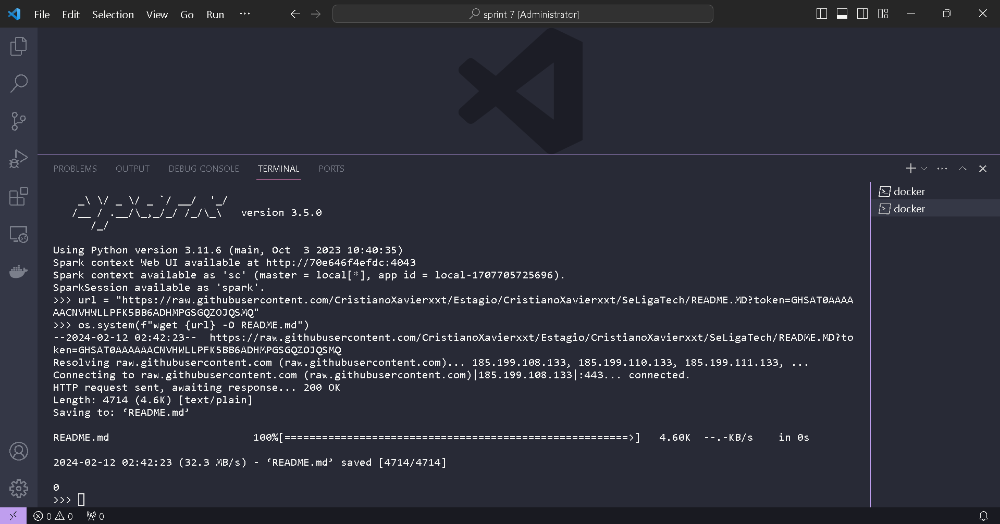
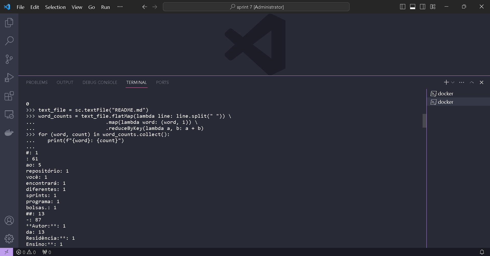
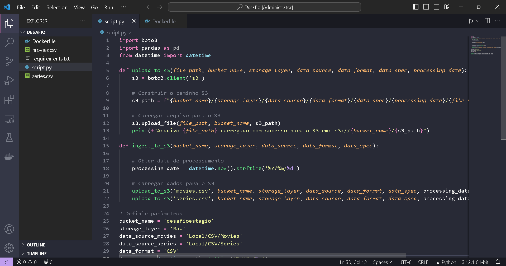
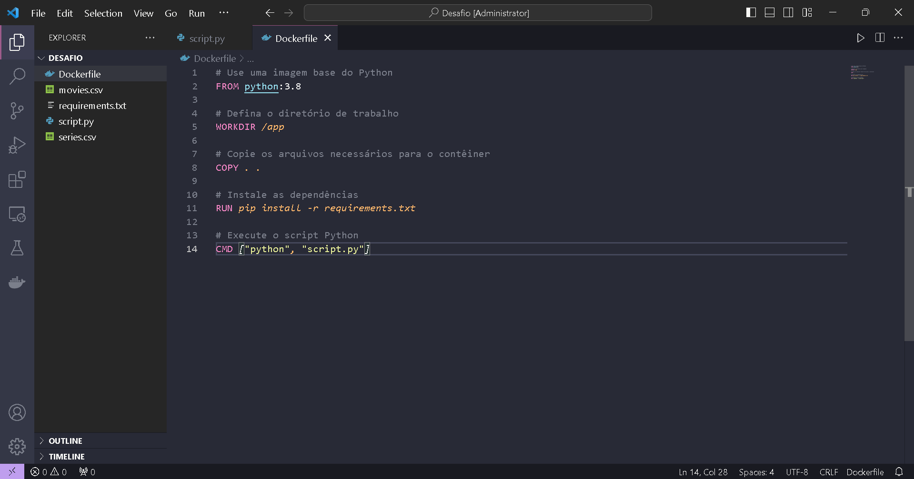

## Sprint 7

Aprendizagem da sprint:

- Neste sprint estudamos sobre um dos mais importantes frameworks de processamento de dados, o apache spark e com ele o apache Hadoop.
- Tivemos nesse sprint também exercícios para treinar o que aprendemos sobre o spark e mais um pouco sobre AWS, como exercício final demos início ao desafio que será entregue no sprint 10.

## Exercicios

- [Exercicios python](exercicios/exercios_python.txt)

- [Exercicios Spark](exercicios/exercios_spark.txt)

## Evidencias

Evidencias dos exercicios de python realizados nessa sprint.

 

Evidencias do exercicio de spark

 

Evidencias da concusão dos cursos da sprint

 

Evidencias Desafio parte 1

