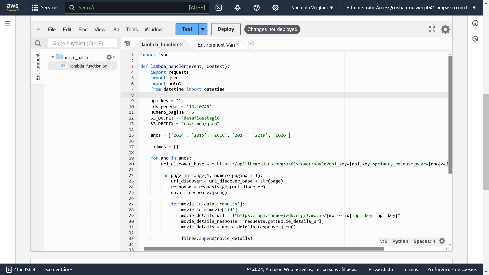

## Sprint 8

Aprendizagem da sprint:

- Continuamos os estudos sobre spark e como utilizar ele em conjunto com a aws para processamento de dados.
- Tivemos nesse sprint também exercícios para treinar o spark e mais um pouco sobre AWS, e demos continuidade ao desafio final.

## Exercicios

- [Exercicio TMDB](exercicios/exercicio_TMDB.txt)

- [Exercicios Spark-1](exercicios/exercicios_spark_1.txt)

- [Exercicios Spark-2](exercicios/exercicios_spark_2.txt)

- [Desafio parte2](exercicios/desafio_parte-2.txt.txt)

## Evidencias

Evidencia do exercicio TMDB realizado nessa sprint.

 

Evidencias dos exercicios de spark parte 1

 

Evidencias dos exercicios de spark parte 2

 

Evidencias Desafio parte 2

