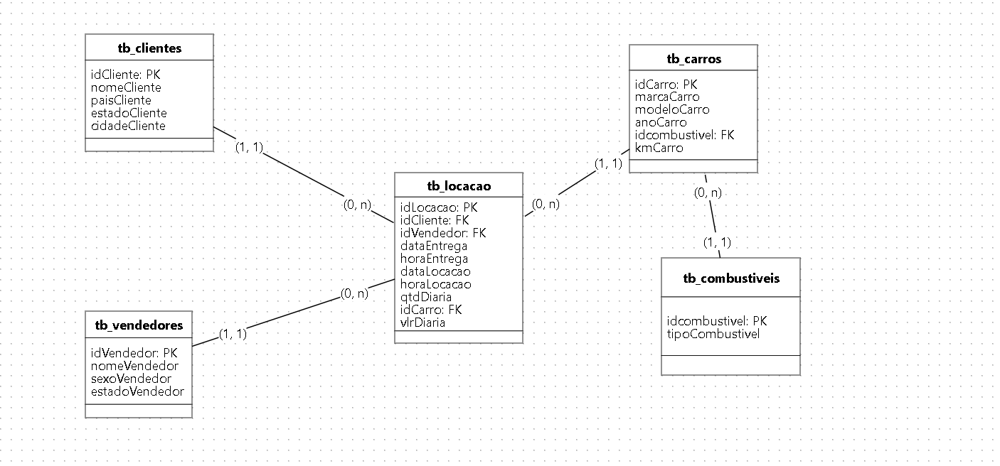
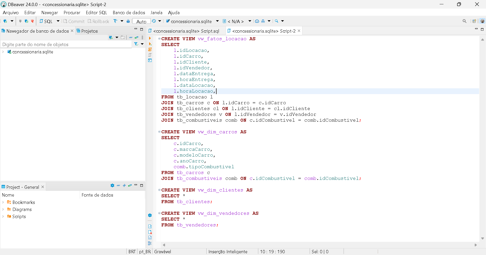
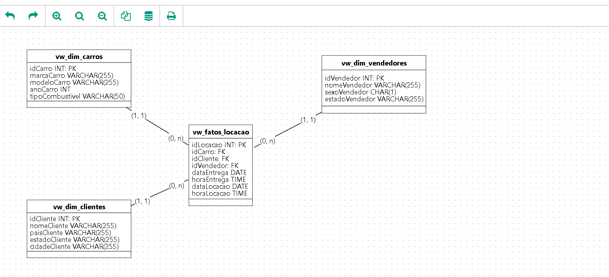

## Sprint 9

Aprendizagem da sprint:

- Nesta sprint estudamos as melhores formas de se elaborar estruturas para armazenamento de dados visando consultas futuras.

## Exercicios

- [Exercicio Mondelagem de dados 1](exercicios/exercicio_1/Script.sql)
  [README](exercicios/exercicio_1/README.md)

- [Exercicios Mondelagem de dados 2](exercicios/exercicio_2/Script-2.sql)
  [README](exercicios/exercicio_2/README.MD)

## Evidencias

Evidencia dos exercicios de modelagem de dados.

