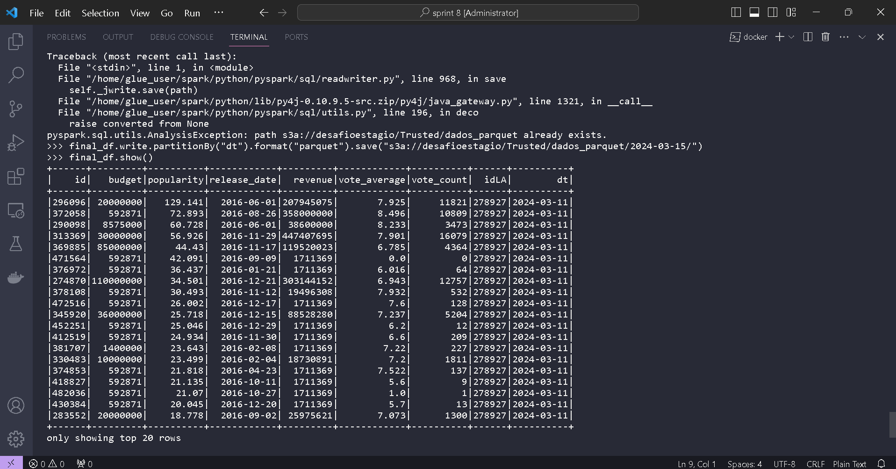

## Sprint 9

Aprendizagem da sprint:

- Nesta sprint estudamos as melhores formas de se elaborar estruturas para armazenamento de dados visando consultas futuras.
- Também trabalhamos a parte 3 do desafio final do programa de bolsas.

## Exercicios

- [Exercicio Mondelagem de dados 1](exercicios/exercicio_1/Script.sql)
  [README](exercicios/exercicio_1/README.md)

- [Exercicios Mondelagem de dados 2](exercicios/exercicio_2/Script-2.sql)
  [README](exercicios/exercicio_2/README.MD)

- [Exercicios Desafio 3.1](exercicios/Desafio%203.1/cadama_trusted.txt)
  [README](exercicios/Desafio%203.1/README.MD)

- [Exercicios Desafio 3.2](exercicios/Desafio%203.2/README.MD)

- [Exercicios Desafio 3.3](exercicios/Desafio%203.3/camada_refined.txt)
  [README](exercicios/Desafio%203.3/README.MD)

## Evidencias

Evidencia dos exercicios de modelagem de dados.

