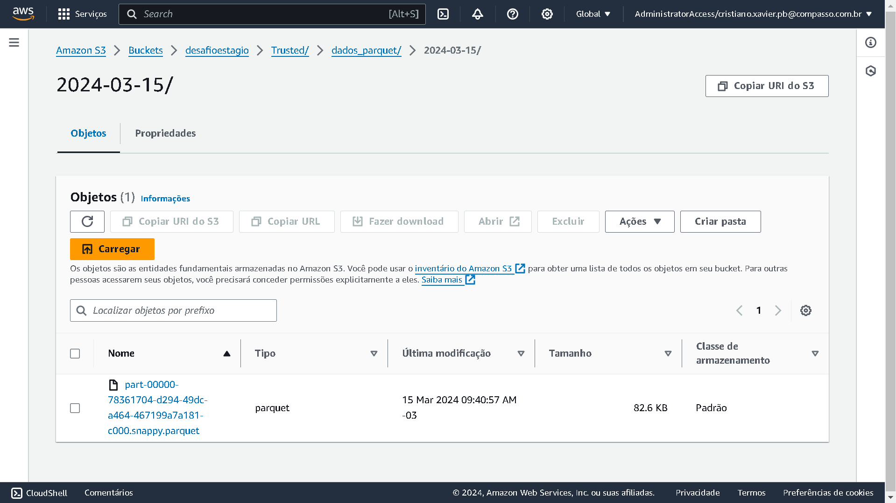

## Primeira etapa
    No começo de tudo eu tive que fazer pull da imagem do aws glue para rodar ele localmente
    depois eu tive que construir o container passando minhas credenciais de acesso da aws

## Segunda etapa
    Aqui eu fiz o download dos json's da camada Raw e filtrei todos os dados que continham o valor null ou 0 exceto na coluna vote_count e vote_avarege

## Terceira etapa 
    Aqui eu crie a coluna dt no meu dataframe no spark com a data de quando eu baixe os meus dados da api, como todos eles vinheram no mesmo dia eu coloquei apenas uma unica data,
    apos isso eu envie esse dataframe no formato parquet para minha camada Trusted na aws.

