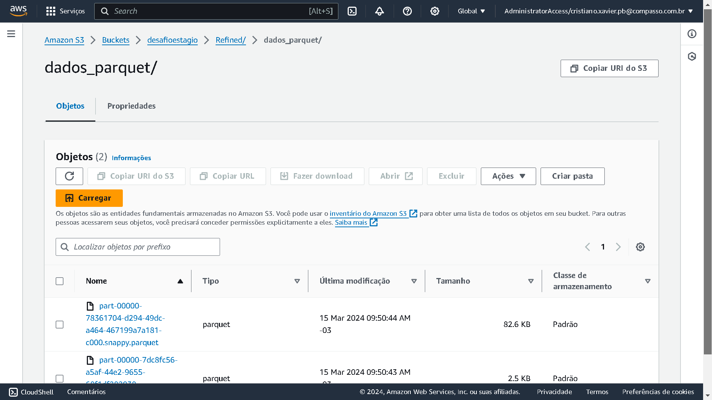

## Conclusão
    Nesta etapa do desafio eu apenas peguei os dados que estavam na trusted baixe e selecionei as colunas que queria manter como descrevi no modelo, depois eu adicionei a coluna idLA para um possivel relacionamento com a tabela live_actions que posso ter no futuro e no final subi esse arquivo no formato parquet para a camada refined.

 